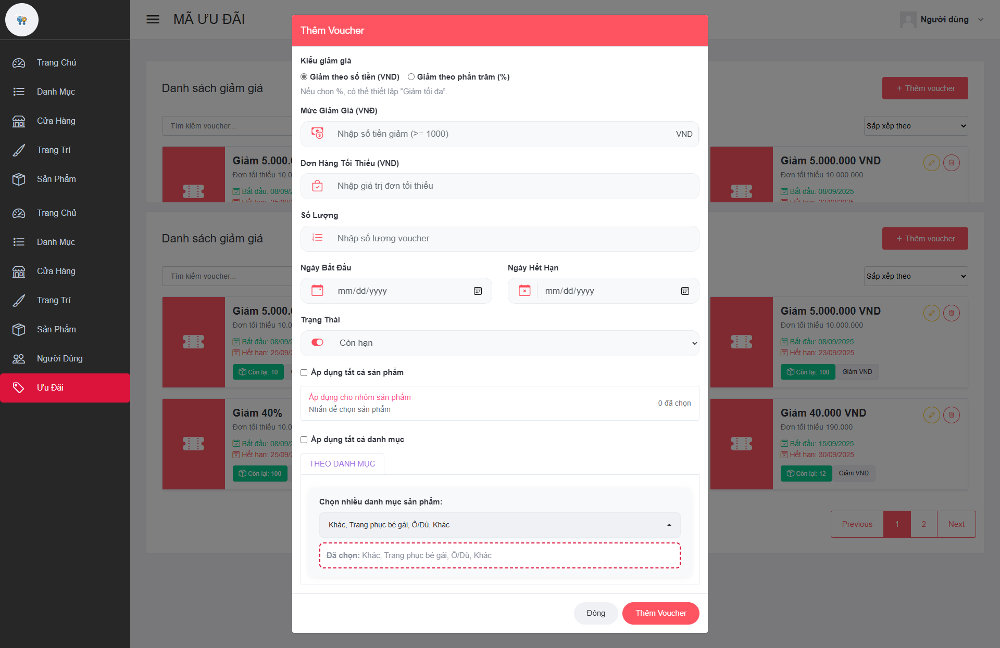

 Dự án - Sàn thương mại điện tử (chuyên về thời trang) 
**Có 2 thư mục chính**
- **DATN-API:** Xây dựng bằng ASP.NET Core Web API (.NET 8)
- **DATN-GO:** Giao diện website (ASP.NET MVC)
- **SQL Sever**
- **Trong appsetting:** cấu hình kết nối csdl --> Add migration --> Update database. Thêm các api cần thiết.

## 🧩 Luồng hoạt động hệ thống

### 🧍 Vai trò: User

Trang chủ của website. Tại đây sẽ có:
- Các **slide quảng cáo** hiển thị sản phẩm nổi bật.
- **Danh mục** được lấy từ dữ liệu và hiển thị trực tiếp.
- **Cửa hàng nổi bật**, dựa vào lượt bán và đánh giá cao nhất.
- **Phần gợi ý** hiển thị các sản phẩm hot trend.
- **Mục Thịnh hành** bao gồm danh mục xu hướng.
- **Mục Nổi bật** hiển thị các sản phẩm có doanh thu và đánh giá tốt nhất trong tháng.
Người dùng có thể **tìm kiếm sản phẩm bằng Chatbox AI**, ví dụ: “áo thun”.
Khi chọn sản phẩm, hệ thống hiển thị thông tin chi tiết gồm:
- Tên sản phẩm, cửa hàng, giá tiền, biến thể, số lượng còn lại.
- Mô tả chi tiết sản phẩm, phần đánh giá, và các sản phẩm gợi ý cùng cửa hàng.

Người dùng chọn biến thể → **thêm vào giỏ hàng**.

---

### 🛒 Vai trò: User (Giỏ hàng & Thanh toán)

- Giỏ hàng hiển thị các sản phẩm được phân loại theo cửa hàng.
- Người dùng xem được:
  - Biến thể đã chọn
  - Số lượng
  - Giá gốc và thành tiền
- Có thể chỉnh sửa, xóa, hoặc chọn mua sản phẩm.

Phần bên phải gồm:
- **Địa chỉ giao hàng** (bắt buộc phải có).
- **Chọn voucher giảm giá**.
- **Thành tiền và phí vận chuyển** (lấy từ API môi trường test của GHTK, tính theo khối lượng, số lượng và khoảng cách).
- **Phương thức thanh toán**: ví sàn, Momo, VNPay, thanh toán trực tiếp.

Người dùng tiến hành **thanh toán qua Momo**.

---

### 📦 Vai trò: User (Đơn hàng của tôi)

Trang **Đơn hàng của tôi** bao gồm các mục:
- Chờ xác nhận
- Chờ lấy hàng
- Đang giao
- Đã giao

Mỗi đơn hàng hiển thị các trạng thái khác nhau.  
Người dùng có thể **xem chi tiết hoặc hủy đơn hàng**.

Trong chi tiết đơn hàng có:
- Phương thức thanh toán
- Đơn vị vận chuyển
- Mã vận đơn (GHTK)
- Danh sách sản phẩm và tổng tiền

---

### 🏪 Vai trò: Seller (Người bán)

#### Hoàn thành đơn
- Khi đơn hàng hoàn thành, **tiền sẽ được chuyển vào ví cửa hàng (95%)**,  
  **5% còn lại là phí hoa hồng của sàn.**
- Cửa hàng có thể **gửi yêu cầu rút tiền**, điều kiện:
  - Số tiền > 50.000₫
  - Rút toàn bộ số dư
---

### 🛡️ Vai trò: Admin (Xử lý yêu cầu & xác nhận)

Admin có quyền:
- Xem và xử lý **yêu cầu rút tiền**.
- Kiểm tra thông tin chuyển khoản (thực hiện thủ công do môi trường test).
- Có thể **từ chối hoặc xác nhận** yêu cầu hợp lệ.
- Khi xác nhận → Seller được thông báo trạng thái rút tiền thành công.

---

### 🧾 Vai trò: Seller (Quản lý cửa hàng)

Người dùng đăng ký trở thành người bán:
- Nhập thông tin cửa hàng, hình ảnh, số điện thoại.
- Sử dụng **FPT.AI** để quét CCCD/CMND.
- Cung cấp **thông tin chuyển khoản** và **địa chỉ lấy hàng**.

Sau khi đăng ký, **Admin phê duyệt cửa hàng**.

#### Quản lý cửa hàng bao gồm:
- **Xem & chỉnh sửa thông tin cửa hàng**
- **Quản lý sản phẩm**:
  - Xem chi tiết sản phẩm
  - Thêm sản phẩm (có hoặc không có biến thể)
  - Sản phẩm mới thêm ở trạng thái **Chờ duyệt**
- **Quản lý voucher**:
  - Tạo voucher giảm tiền hoặc giảm phần trăm
  - Áp dụng cho sản phẩm hoặc danh mục cụ thể

Voucher hiển thị tại cửa hàng và **User có thể lưu lại để sử dụng**.

---

### 🧑‍💼 Vai trò: Admin (Quản lý hệ thống)

Trong giao diện quản trị:
- Tổng quan hệ thống:
  - Số lượng cửa hàng và sản phẩm
  - Tổng doanh thu, phí hoa hồng của sàn
  - Doanh thu theo tháng
  - Biểu đồ tăng trưởng cửa hàng và sản phẩm theo tháng/năm

#### Các chức năng chính:
- **Danh mục:** thêm/sửa/xóa danh mục, hiển thị trực tiếp bên User.
- **Cửa hàng:** duyệt và xem chi tiết thông tin cửa hàng.
- **Sản phẩm:** duyệt/từ chối sản phẩm đăng bán.
- **Voucher:** thêm voucher chung cho sàn, hiển thị bên ngoài giao diện chính.

---

## 📚 Tổng kết
- **User:** mua hàng, thanh toán, quản lý đơn
- **Seller:** bán hàng, quản lý cửa hàng, rút tiền
- **Admin:** quản lý hệ thống, duyệt cửa hàng/sản phẩm, xử lý luồng tiền

Tất cả các luồng đều được tích hợp API, cơ chế thanh toán, vận chuyển, và quản lý ví ảo nhằm mô phỏng hệ thống thực tế trong môi trường test.

## 📸 Giao diện cơ bản

